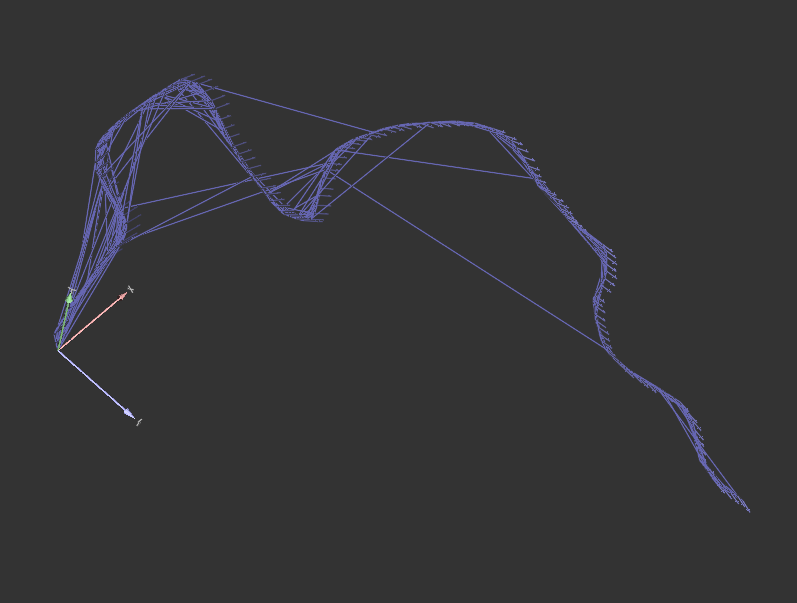
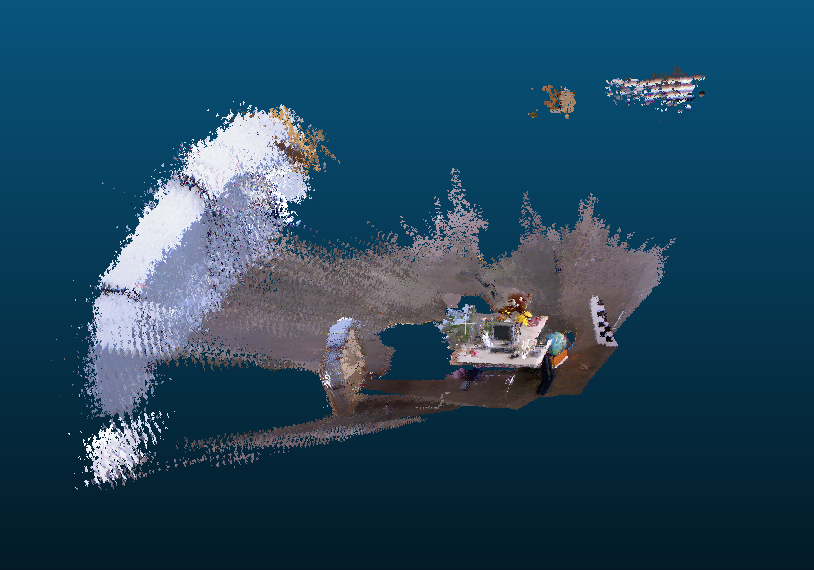

##  SLAM-RGBD

高博系列博客的练习。更正了一些错误。读取图片的方式做了更改，便于使用TUM数据集。main.cpp是不想关的文件。特征点提取改用opencv3方式。

##  结果

G2O优化结果


重建结果：


##  编译运行

具体的可执行文件编译参考CMakeLists.txt：

```c

# add_executable(epnp main.cpp)
# target_link_libraries(epnp 
# ${OpenCV_LIBS}
# ${EIGEN3_LIBS}
# ${Sophus_LIBS}
# )

# add_executable(pointcloud ./src/generatePointCloud.cpp)
# target_link_libraries(pointcloud 
# ${OpenCV_LIBS}
# ${EIGEN3_LIBS}
# ${Sophus_LIBS}
# ${PCL_LIBRARIES} 
# )

# ADD_EXECUTABLE( detectFeatures ./src/detectFeatures.cpp)
# TARGET_LINK_LIBRARIES( detectFeatures 
#     slambase
#     ${OpenCV_LIBS} 
#     ${PCL_LIBRARIES} )


# ADD_EXECUTABLE( visualOdometry ./src/visualOdometry.cpp)
# TARGET_LINK_LIBRARIES( visualOdometry 
#     slambase
#     ${OpenCV_LIBS} 
#     ${PCL_LIBRARIES}
#     #${PROJECT_SOURCE_DIR}/Thirdparty/g2o/lib/libg2o.so
#     ${CSPARSE_LIB} )


# ADD_EXECUTABLE( slamend ./src/slamEnd.cpp)
# TARGET_LINK_LIBRARIES( slamend 
#     slambase
#     ${OpenCV_LIBS} 
#     ${PCL_LIBRARIES}
#     ${G2O_LIB} 
#     ${CSPARSE_LIB} 
#     g2o_core g2o_types_slam3d g2o_solver_csparse g2o_stuff g2o_csparse_extension 
#     ${CSPARSE_LIBRARY}
#     )


ADD_EXECUTABLE( slam ./src/slam.cpp)
TARGET_LINK_LIBRARIES( slam 
    slambase
    ${OpenCV_LIBS} 
    ${PCL_LIBRARIES}
    ${G2O_LIB} 
    ${CSPARSE_LIB} 
    g2o_core g2o_types_slam3d g2o_solver_csparse g2o_stuff g2o_csparse_extension 
    ${CSPARSE_LIBRARY}
    )
```


##  相关参考博客

- [一起做RGB-D SLAM](https://www.cnblogs.com/gaoxiang12/tag/一起做RGB-D%20SLAM/)
- [g2o_viewer](https://blog.csdn.net/fb_941219/article/details/107728123)
- [G2O优化](https://blog.csdn.net/fb_941219/article/details/107757706)
- [fatal error: sophus/se3.h: 没有那个文件或目录](https://blog.csdn.net/fb_941219/article/details/104590842?ops_request_misc=%257B%2522request%255Fid%2522%253A%2522159646584119725211930569%2522%252C%2522scm%2522%253A%252220140713.130102334.pc%255Fblog.%2522%257D&request_id=159646584119725211930569&biz_id=0&utm_medium=distribute.pc_search_result.none-task-blog-2~blog~first_rank_v2~rank_blog_v1-2-104590842.pc_v2_rank_blog_v1&utm_term=sophus&spm=1018.2118.3001.4187)
- [Ubuntu16 下 OpenCV 的一些报错及操作](http://www.jeepxie.net/article/924885.html)
- [《视觉SLAM十四讲》第六讲g2o实践代码报错解决方法](https://www.cnblogs.com/xueyuanaichiyu/p/7921382.html)
- [关于高博3d2d程序报错的改动](https://blog.csdn.net/robinhjwy/article/details/78084210)

- [PCL经典代码赏析四：点云滤波](https://blog.csdn.net/qq_34719188/article/details/79179430)

